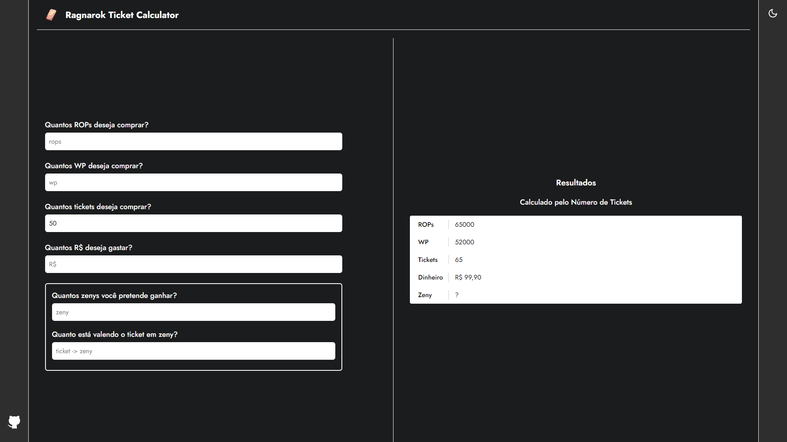

# Ragnarok Ticket Calculator

<https://ragnarok-ticket-calculator.vercel.app>




## 🚀 Instalação

Clone o repositório:

```shell
git clone https://github.com/Lucas8x/ragnarok-ticket-calculator.git
```

Entre na pasta:

```shell
cd ragnarok-ticket-calculator
```

Instale as dependências:

```shell
npm install
```

Incie o projeto:

```shell
npm run dev
```

Acesse na url <http://localhost:3000>

## 📝 Licença

Este projeto esta sob a licença [MIT](./LICENSE).
